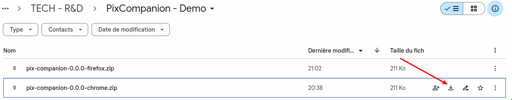
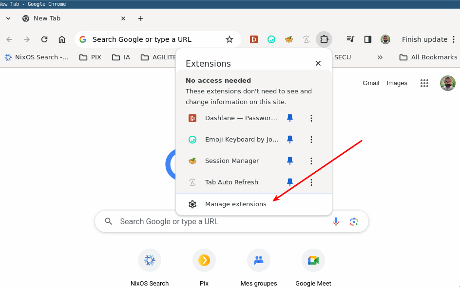
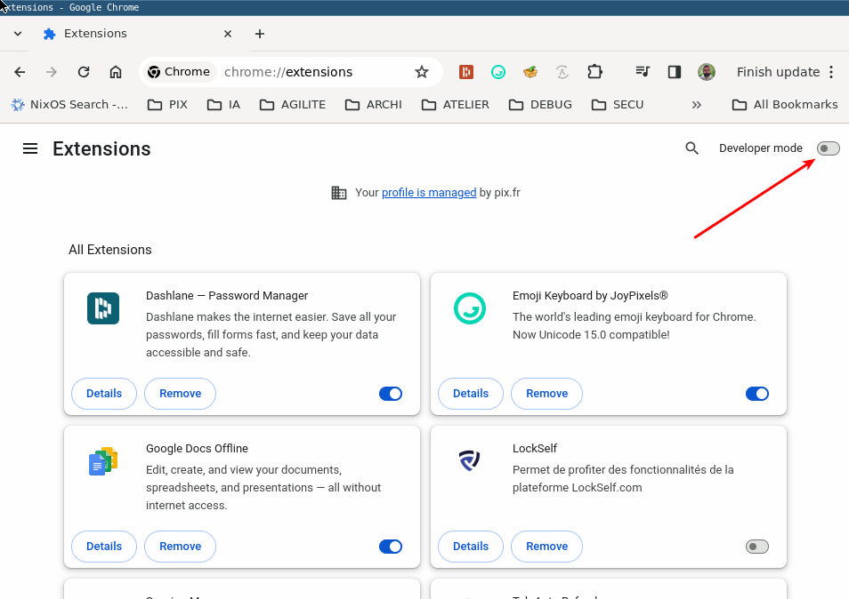
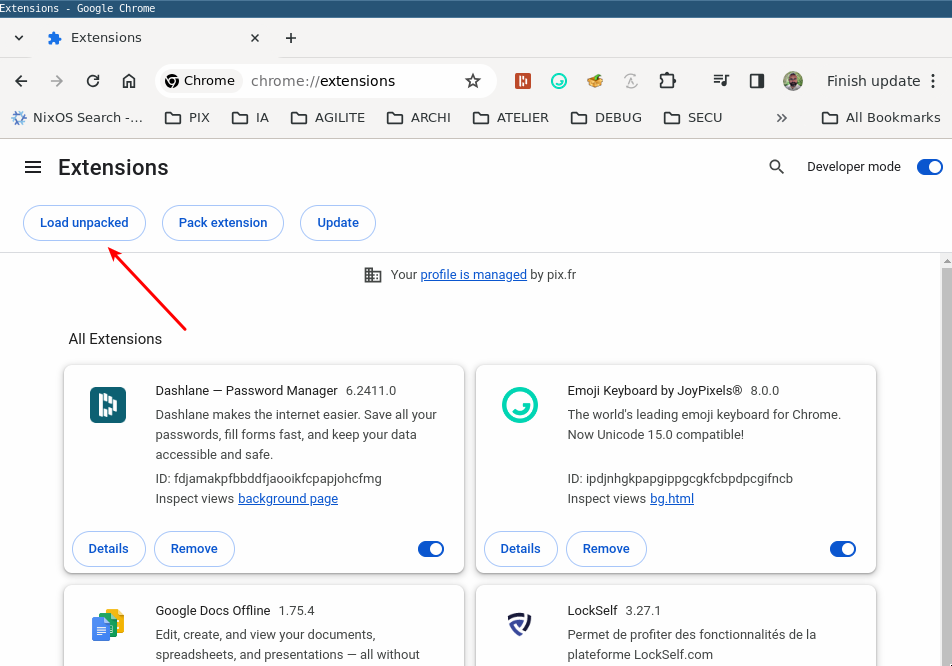
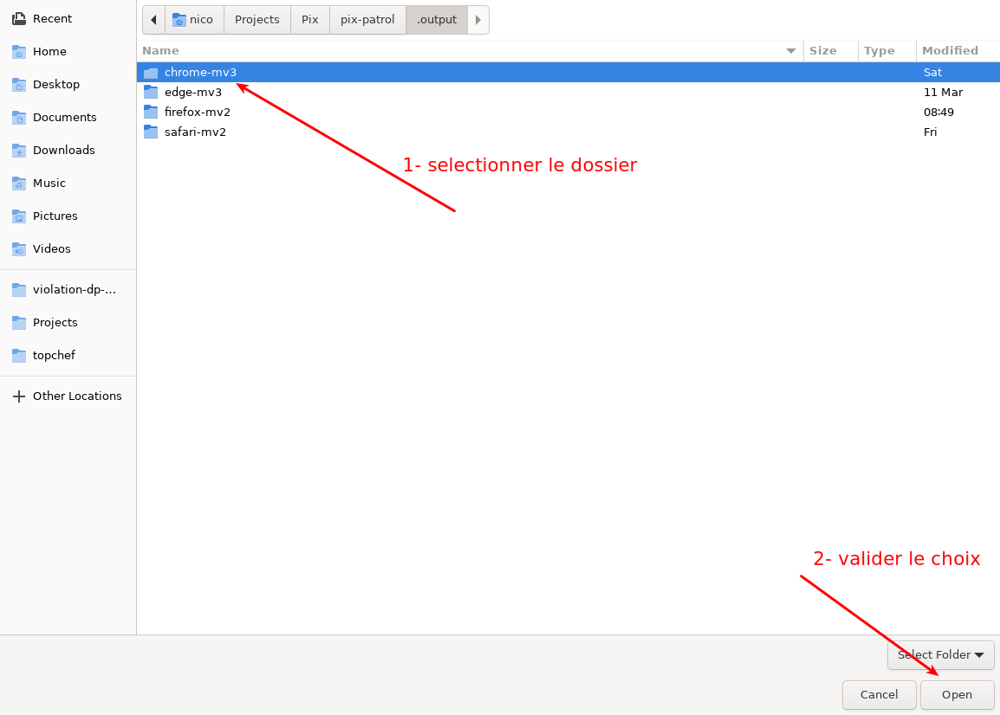
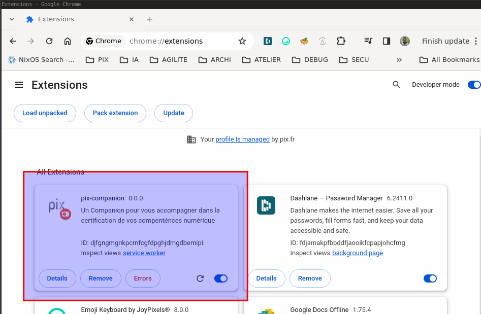
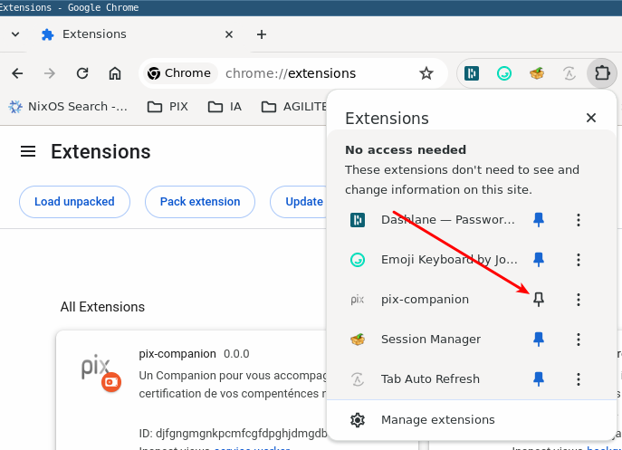
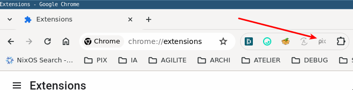
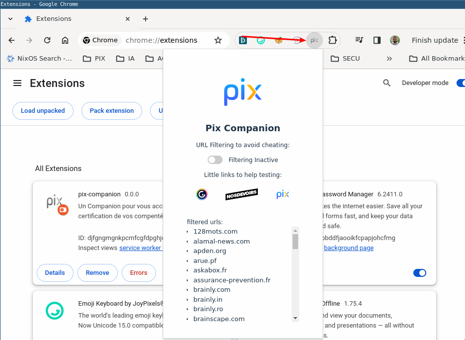

= Installer l'extension Pix Companion sur Chrome

== Télécharger l'archive
ouvrir cette page : +
https://drive.google.com/drive/u/0/folders/1BpUbmFJ6NGttLn1NJfYt2amSedT7HXsG

.telecharger le fichier comme indique ici

créer un nouveau repertoire +
déplacer le fichier télécharger dans ce nouveau repertoire +
décompresser le fichier zip dans ce repertoire

== Installer l'extension

.localiser le bouton de gestion des extensions dans Chrome

.activer le mode developper

.charger une extension non packagée

.choisir le dossier ou vous avez decompresser le zip sur le poste

.Pix Companion est installé

.Pour ajouter Pix Companion a la barre d'action de chrome

.Pix Companion est donc disponible, il suffit de clicker dessus

.Pix Companion est actif, activer le switch pour filtrer les resultats en fonction de la liste affichees.

