== Installer l'extension Pix Companion sur Firefox

=== Télécharger l'archive

ouvrir cette page : +
https://drive.google.com/drive/u/0/folders/1BpUbmFJ6NGttLn1NJfYt2amSedT7HXsG

.telecharger le fichier comme indique ici
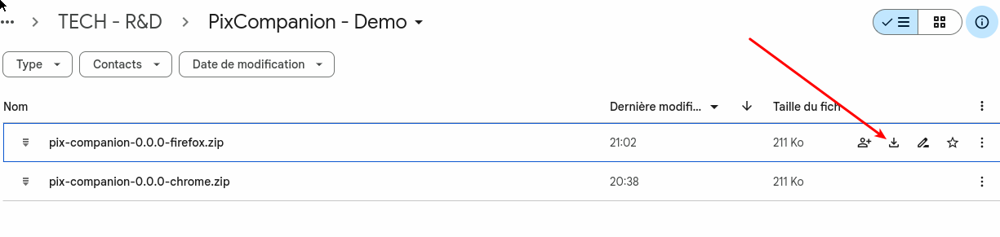

=== Installer l'extension

.localiser le bouton de gestion des extensions dans Firefox
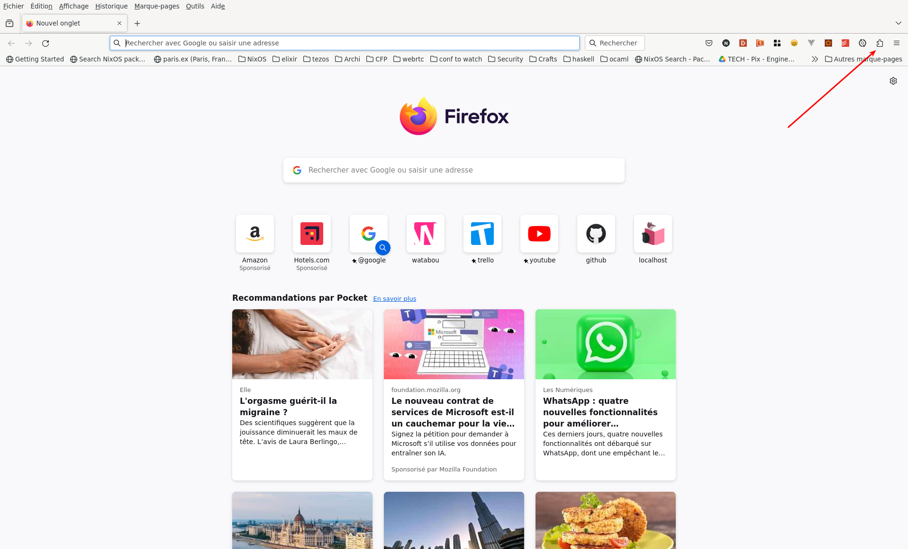

.gerer les extensions
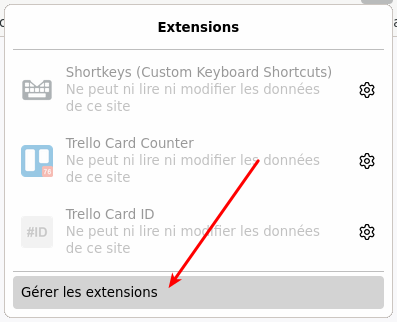

.ouvrir l'interface de gestion des extensions
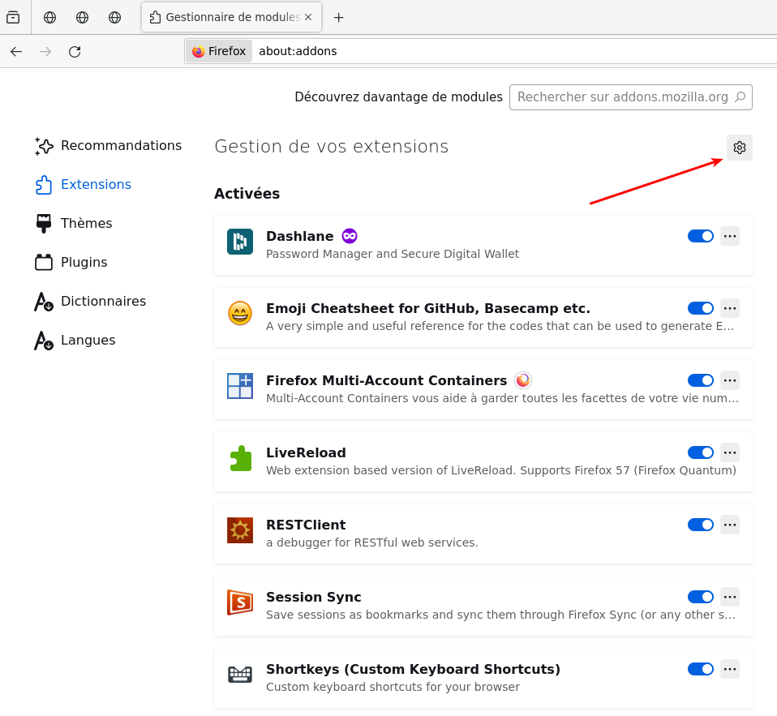

.installer un module en debug (obligatoire tant qu'on a pas signer l'extension)
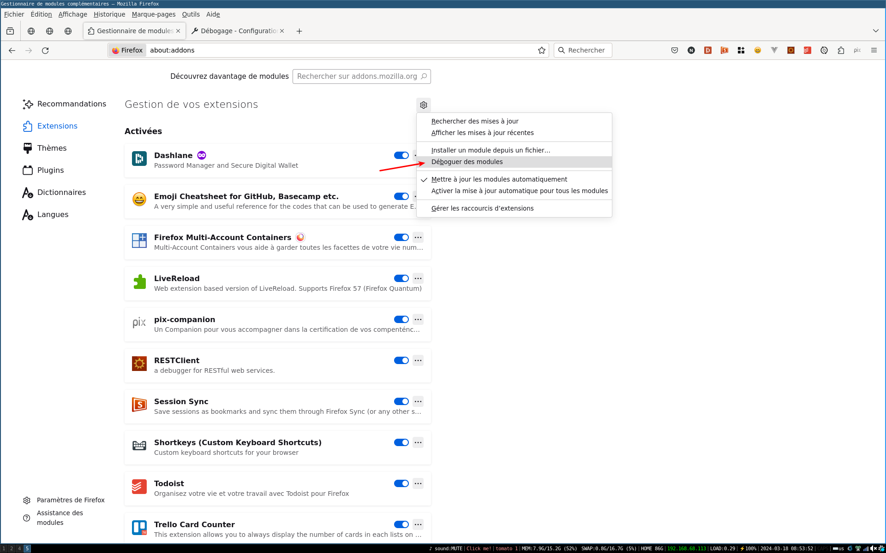

.affichage de l'interface de gestion des extensions temporaires
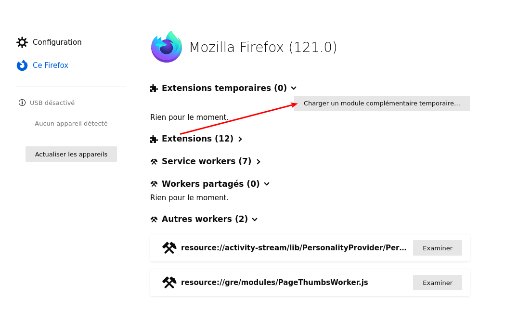

.selection du fichier .zip depuis votre disque dur (la ou vous avez telecharge l'archive)
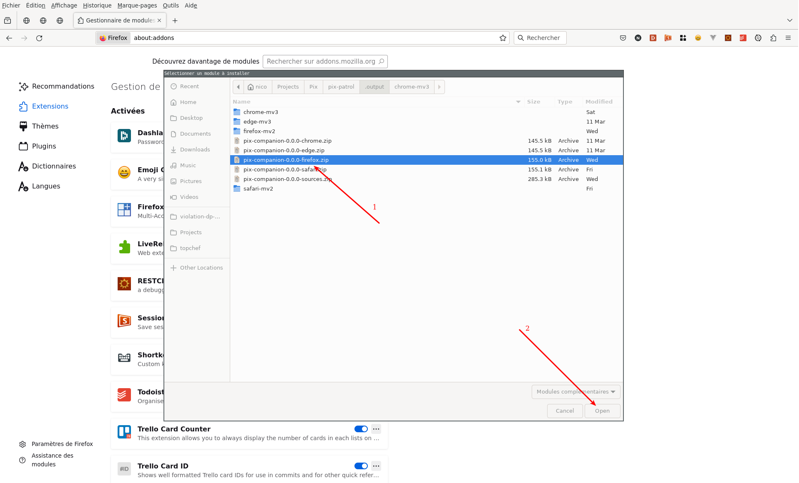

.l'extension Pix Companion est disponible
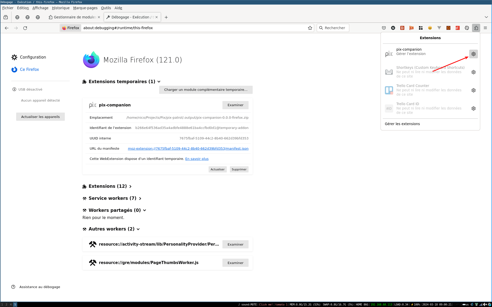

.ouvrir le menu des extensions dans l'interface principale
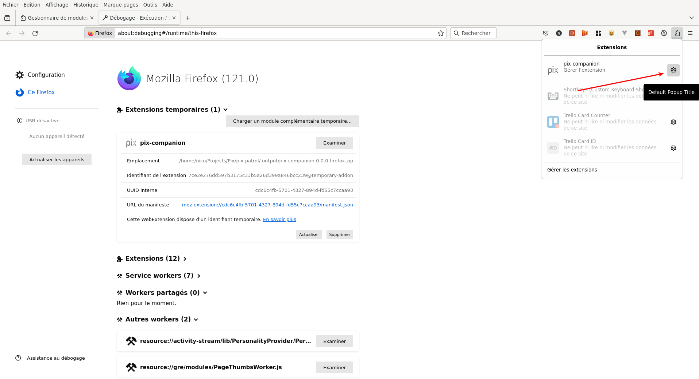

.gerer l'extension Pix Companion elle meme
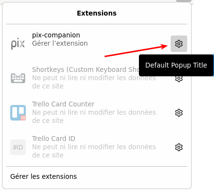

.ajouter Pix Companion dans la barre d'action de Firefox
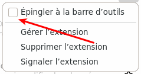

.l'icone de Pix Companion juste à coté de l'icone des extensions
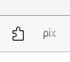

.Pix Companion est actif, activer le switch pour filtrer les resultats en fonction de la liste affichees.
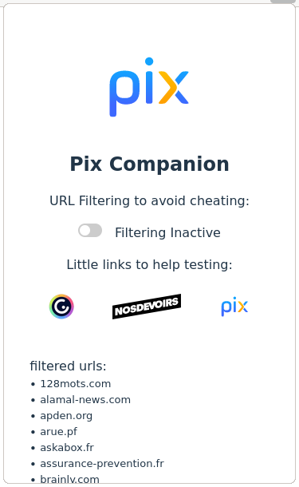
